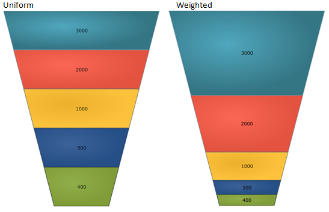
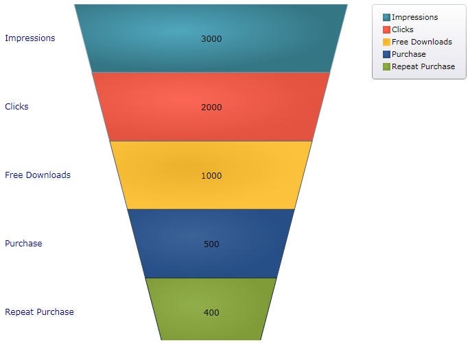
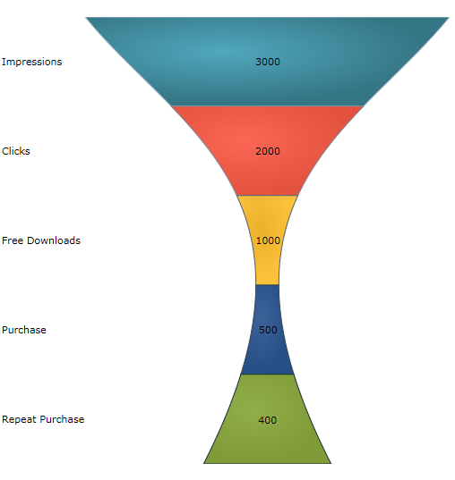

////
|metadata|
{
    "name": "funnelchart-getting-started-with-funnelchart",
    "controlName": ["{FunnelChartName}"],
    "tags": ["Getting Started"],
    "guid": "b9cf7ea0-bead-438b-b6a8-dde63baad4c2",
    "buildFlags": ["SL","WPF","win-phone","ANDROID"],
    "createdOn": "2014-06-05T19:53:12.0338816Z"
}
|metadata|
////

= Getting Started with {FunnelChartName}

The purpose of this topic is to demonstrate how to configure and use the various key features and functionalities of the link:{FunnelChartLink}.{FunnelChartName}.html[{FunnelChartName}]™ control.

== Using {FunnelChartName}

This section contains important conceptual and task-based information that will help you identify the features and show the usage with examples.

== Required background

You need to first read the following topic:

* link:funnelchart-data-binding.html[Data Binding]

== Control Configuration Overview

== Control configuration chart

The table below lists the configurable elements and behaviors of the {FunnelChartName} control.

[options="header", cols="a,a,a"]
|====
|Configurable elements and behavior|Configuration details|Configuration properties

|Slice Selection
|Describes how to enable the slice selection, and also specify the display format of the slices.
| link:{FunnelChartLink}.{FunnelChartName}{ApiProp}allowsliceselection.html[AllowSliceSelection] 

link:{FunnelChartLink}.{FunnelChartName}{ApiProp}funnelslicedisplay.html[FunnelSliceDisplay]

|Invert Slices
|Demonstrates how to invert the slices, which represent the sections of the data, vertically.
| link:{FunnelChartLink}.{FunnelChartName}{ApiProp}isinverted.html[IsInverted]

|Display the Labels
|To display the Labels, InnerLabelMemberPath and OuterLabelMemberPath should be set to the target property. pick:[sl,wpf,win-universal="Outer labels visibility is Collapsed by default and inner label visibility is visible by default."]
|
ifdef::sl,wpf,win-universal[] 
pick:[sl,wpf,win-universal="link:{FunnelChartLink}.{FunnelChartName}{ApiProp}innerlabelvisibility.html[InnerLabelVisibility]"] 

endif::sl,wpf,win-universal[] 

link:{FunnelChartLink}.{FunnelChartName}{ApiProp}innerlabelmemberpath.html[InnerLabelMemeberPath] 

pick:[sl,wpf,win-universal="link:{FunnelChartLink}.{FunnelChartName}{ApiProp}outerlabelvisibility.html[OuterLabelVisibility]"] 

link:{FunnelChartLink}.{FunnelChartName}{ApiProp}outerlabelmemberpath.html[OuterLabelMemberPath]

|Display the Legend
|Displaying the legend requires creating an instance of an ItemLegend and setting it on the legend property of the funnel chart control.
| link:{FunnelChartLink}.{FunnelChartName}{ApiProp}legend.html[Legend] 

link:{FunnelChartLink}.{FunnelChartName}{ApiProp}useouterlabelsforlegend.html[UseOuterLabelsForLegend]

|Use Bezier Curve
|Using Bezier curves gives the funnel chart a smooth-line appearance
| link:{FunnelChartLink}.{FunnelChartName}{ApiProp}usebeziercurve.html[UseBezierCurve]

|====

== Slice selection

== Slice Selection property settings

The table below maps the desired configurations/behaviors to the corresponding property settings.

[options="header", cols="a,a,a"]
|====
|In order to…|Use this property:|And set it to…

|Enable Slice Selection
| link:{FunnelChartLink}.{FunnelChartName}{ApiProp}allowsliceselection.html[AllowSliceSelection]
|True

|Specify the display format of the slices
| link:{FunnelChartLink}.{FunnelChartName}{ApiProp}funnelslicedisplay.html[FunnelSliceDisplay]
|Uniform 

Weighted

|====

== Slice Selection code example

In order to enable slice selection the link:{FunnelChartLink}.{FunnelChartName}{ApiProp}allowsliceselection.html[AllowSliceSelection] property must be set to true.

pick:[sl,win-phone,win-universal,wpf="*In Visual Basic:*"]

ifdef::sl,win-phone,win-universal,wpf[]
----
funnel.AllowSliceSelection = True
----
endif::sl,win-phone,win-universal,wpf[]

pick:[sl,win-phone,win-universal,wpf="*In C#:*"]

ifdef::sl,win-phone,win-universal,wpf[]
----
funnel.AllowSliceSelection = true;
----
endif::sl,win-phone,win-universal,wpf[]

pick:[sl,win-phone,win-universal,wpf="*In XAML:*"]

ifdef::sl,win-phone,win-universal,wpf[]
----
<ig:{FunnelChartName} AllowSliceSelection="/>
----
endif::sl,win-phone,win-universal,wpf[]

ifdef::android[]

*In Java:*

[source,js]
----
funnelChart.setAllowSliceSelection(true);
----

endif::android[]

The {FunnelChartName} control exposes two display format types:

[start=1]
. Uniform where all slices have the same height (default).

Weighted where the heights of the slices are based on the calculated percentage value of the underlying data.

pick:[sl,win-phone,win-universal,wpf="*In Visual Basic:*"]

ifdef::sl,win-phone,win-universal,wpf[]
----
funnel.FunnelSliceDisplay = FunnelSliceDisplay.Uniform
----
endif::sl,win-phone,win-universal,wpf[]

pick:[sl,win-phone,win-universal,wpf="*In C#:*"]

ifdef::sl,win-phone,win-universal,wpf[]
----
funnel.FunnelSliceDisplay = FunnelSliceDisplay.Uniform;
----
endif::sl,win-phone,win-universal,wpf[]

pick:[sl,win-phone,win-universal,wpf="*In XAML:*"]

ifdef::sl,win-phone,win-universal,wpf[]
----
<ig:{FunnelChartName} FunnelSliceDisplay="Uniform"/>
----
endif::sl,win-phone,win-universal,wpf[]

ifdef::android[]

*In Java:*

[source,js]
----
funnelChart.setFunnelSliceDisplay(FunnelSliceDisplay.UNIFORM);
----

endif::android[]

Figure 1: FunnelChart Display format

== Invert Slices

== Invert Slices property settings

The table below maps the desired configurations/behaviors to the corresponding property settings.

[options="header", cols="a,a,a"]
|====
|In order to…|Use this property:|And set it to…

|Invert Slices
| link:{FunnelChartLink}.{FunnelChartName}{ApiProp}isinverted.html[IsInverted]
|True

|====

== Invert Slices code example

In order to invert the slices on the control the link:{FunnelChartLink}.{FunnelChartName}{ApiProp}isinverted.html[IsInverted] property must be set to true (default is false) Inverting the slices can also be triggered by a button click.

pick:[sl,win-phone,win-universal,wpf="*In Visual Basic:*"]

ifdef::sl,win-phone,win-universal,wpf[]
----
funnel.IsInverted = true
----
endif::sl,win-phone,win-universal,wpf[]

pick:[sl,win-phone,win-universal,wpf="*In C#:*"]

ifdef::sl,win-phone,win-universal,wpf[]
----
funnel.IsInverted = true;
----
endif::sl,win-phone,win-universal,wpf[]

pick:[sl,win-phone,win-universal,wpf="*In XAML:*"]

ifdef::sl,win-phone,win-universal,wpf[]
----
<ig:{FunnelChartName} IsInverted="True"/>
----
endif::sl,win-phone,win-universal,wpf[]

ifdef::android[]

*In Java:*

[source,js]
----
funnelChart.setIsInverted(Boolean.TRUE);
----

endif::android[]

== Display the Labels

== Display the Labels property settings

The table below maps the desired configurations/behaviors to the corresponding property settings.

[options="header", cols="a,a,a"]
|====
|In order to…|Use this property:|And set it to…

|Display the Labels
| link:{FunnelChartLink}.{FunnelChartName}{ApiProp}innerlabelmemberpath.html[InnerLabelMemeberPath]
|[Any field of the data model]

|
| link:{FunnelChartLink}.{FunnelChartName}{ApiProp}outerlabelmemberpath.html[OuterLabelMemberPath]
|[Any field of the data model]

ifdef::sl,wpf,win-universal[]
|
| pick:[sl,wpf,win-universal=" link:{FunnelChartLink}.{FunnelChartName}{ApiProp}innerlabelvisibility.html[InnerLabelVisibility]"] 
|Visible
endif::sl,wpf,win-universal[]

ifdef::sl,wpf,win-universal[]
|
| pick:[sl,wpf,win-universal=" link:{FunnelChartLink}.{FunnelChartName}{ApiProp}outerlabelvisibility.html[OuterLabelVisibility]"] 
|Visible
endif::sl,wpf,win-universal[]

|====

== Display the Labels code example

Displaying the labels is involved with setting the visibility first, and then specifying the path with the appropriate target.

pick:[sl,win-phone,win-universal,wpf="*In Visual Basic:*"]

ifdef::sl,win-phone,win-universal,wpf[]
----
funnel.InnerLabelVisibility = System.Windows.Visibility.Visible
funnel.OuterLabelVisibility = System.Windows.Visibility.Visible
funnel.InnerLabelMemberPath = "Value"
funnel.OuterLabelMemberPath = "Label"
----
endif::sl,win-phone,win-universal,wpf[]

pick:[sl,win-phone,win-universal,wpf="*In C#:*"]

ifdef::sl,win-phone,win-universal,wpf[]
----
funnel.InnerLabelVisibility = System.Windows.Visibility.Visible;
funnel.OuterLabelVisibility = System.Windows.Visibility.Visible;
funnel.InnerLabelMemberPath = "Value";
funnel.OuterLabelMemberPath = "Label";
----
endif::sl,win-phone,win-universal,wpf[]

pick:[sl,win-phone,win-universal,wpf="*In XAML:*"]

ifdef::sl,win-phone,win-universal,wpf[]
----
<ig:{FunnelChartName}
     InnerLabelVisibility="Visible"
     OuterLabelVisibility="Visible"
     InnerLabelMemberPath="Value"
     OuterLabelMemberPath="Label"/>
----
endif::sl,win-phone,win-universal,wpf[]

ifdef::android[]

*In Java:*

[source,js]
----
funnelChart.setInnerLabelMemberPath("Value");
funnelChart.setInnerLabelVisibility(Visibility.VISIBLE);
funnelChart.setOuterLabelMemberPath("Label");
funnelChart.setOuterLabelVisibility(Visibility.VISIBLE);
----

endif::android[]

== Display the Legend

== Display the Legend property settings

The table below maps the desired configurations/behaviors to the corresponding property settings.

[options="header", cols="a,a,a"]
|====
|In order to…|Use this property:|And set it to…

|Display the Legend
| link:{FunnelChartLink}.{FunnelChartName}{ApiProp}legend.html[Legend]
|Legend = [Element name of the ItemLegend instance]

|
| link:{FunnelChartLink}.{FunnelChartName}{ApiProp}useouterlabelsforlegend.html[UseOuterLabelsForLegend]
|True

|====

== Display the Legend code example

Displaying the legend requires you to create an instance of ItemLegend and then set the Legend property of the funnel chart control to the element name of the ItemLegend instance.

ifdef::sl,win-phone,win-universal,wpf[]

*In XAML:*

----
<ig:{FunnelChartName} Legend="{Binding ElementName=Legend}" />
<ig:ItemLegend 
     x:Name="Legend" VerticalAlignment="Top" HorizontalAlignment="Right" />
----

endif::sl,win-phone,win-universal,wpf[]

ifdef::android[]

*In Java:*

[source,js]
----
ItemLegendView legend = new ItemLegendView(context);
FrameLayout.LayoutParams legendParams = new FrameLayout.LayoutParams(ViewGroup.LayoutParams.WRAP_CONTENT, ViewGroup.LayoutParams.WRAP_CONTENT);
legendParams.gravity = Gravity.TOP | Gravity.RIGHT;
legend.setLayoutParams(legendParams);
funnelChart.setLegend(legend);
legend.setVisibility(View.VISIBLE);
rootView.addView(legend);
----

endif::android[]

Figure 2: FunnelChart Legend

== Use Bezier Curve

== Use Bezier Curve property settings

The table below maps the desired configurations/behaviors to the corresponding property settings.

[options="header", cols="a,a,a"]
|====
|In order to…|Use this property:|And set it to…

|Use Bezier Curve
| link:{FunnelChartLink}.{FunnelChartName}{ApiProp}usebeziercurve.html[UseBezierCurve]
|True

|====

== Use Bezier code example

The idea of using the Bezier curve is to give smooth-line appearance to the funnel chart control. The {FunnelChartName} exposes two properties of type Point for Bezier curve settings. When the control is set up to use the Bezier curve, the lines on both sides of the funnel will use the control points to move towards the control points forming the curves. For more information see link:http://en.wikipedia.org/wiki/Bézier_curve[Bezier Curve].

UpperBezierControlPoint and LoweBezierControlPoint properties take X/Y coordinates as the control points in the Bezier curve. The following code example shows the property settings and the result is in the accompanying screenshot.

ifdef::sl,win-phone,win-universal,wpf[]

*In XAML:*

----
<ig:{FunnelChartName}
     UseBezierCurve="True"
     UpperBezierControlPoint="0.25, 0.25"
     LowerBezierControlPoint="0.7, 0.4" />
----

endif::sl,win-phone,win-universal,wpf[]

ifdef::android[]

*In Java:*

[source,js]
----
funnelChart.setUseBezierCurve(Boolean.TRUE);
funnelChart.setUpperBezierControlPoint(new PointF(.25f, .25f));
funnelChart.setLowerBezierControlPoint(new PointF(.7f, .4f));
----

endif::android[]

Figure 3: FunnelChart using Bezier curve

== Related Topics

link:funnelchart-data-binding.html[Data Binding] demonstrates how to bind to the funnel Chart.

link:funnelchart-api-overview.html[API Overview] contains the list of namespaces and several key classes to know while programming with the control.