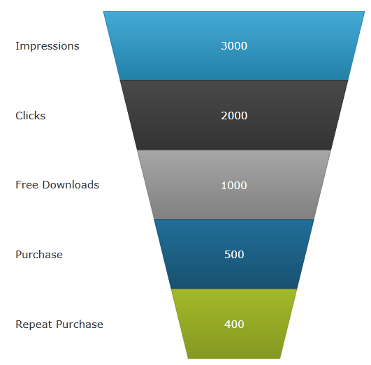
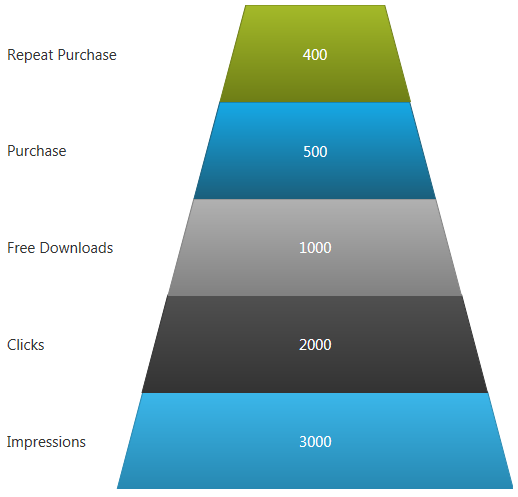

////
|metadata|
{
    "name": "funnelchart",
    "controlName": ["{FunnelChartName}"],
    "tags": ["Getting Started"],
    "guid": "796fd0e0-9374-45dc-9c59-2be04473d51b",
    "buildFlags": ["SL","WPF","win-phone","ANDROID"],
    "createdOn": "2014-06-05T19:53:12.0288794Z"
}
|metadata|
////

= {FunnelChartName}

== Purpose

The purpose of this topic is to introduce the funnel chart. A funnel chart is a type of chart that displays quantities as percentages of a whole, much like a pie chart. Funnel charts are commonly used to display quantitative data in relation to stages of a process. For example, a funnel chart might display expenses of a product from the manufacturing stage to the actual sale of that product.

== Preview

Following is a preview of the {FunnelChartName}.

Figure 1: Sample {FunnelChartName} control

The {FunnelChartName} also allows inverting the slices vertically using the IsInverted Boolean property as in the image below:

Figure 2: Sample {FunnelChartName} inverted

Please refer to the following supporting documents for more information:

* link:funnelchart-getting-started-with-funnelchart.html[Getting Started with {FunnelChartName}], which highlights the key features provided by funnel chart.
* link:funnelchart-data-binding.html[Data Binding] demonstrates how to bind to the funnel chart.

* link:funnelchart-api-overview.html[API Overview] contains the list of namespaces and several key classes to know while programming with the control.